# Fedora Jazz School

This site's purpose is to promote the Fedora Jazz School to musicians of all levels wanting to learn about the art of Jazz. It will inform potential students of the services, prices and location of the school while providing an easy user friendly interface and experience.

[Live site](https://sebzg.github.io/fedora-jazz/)

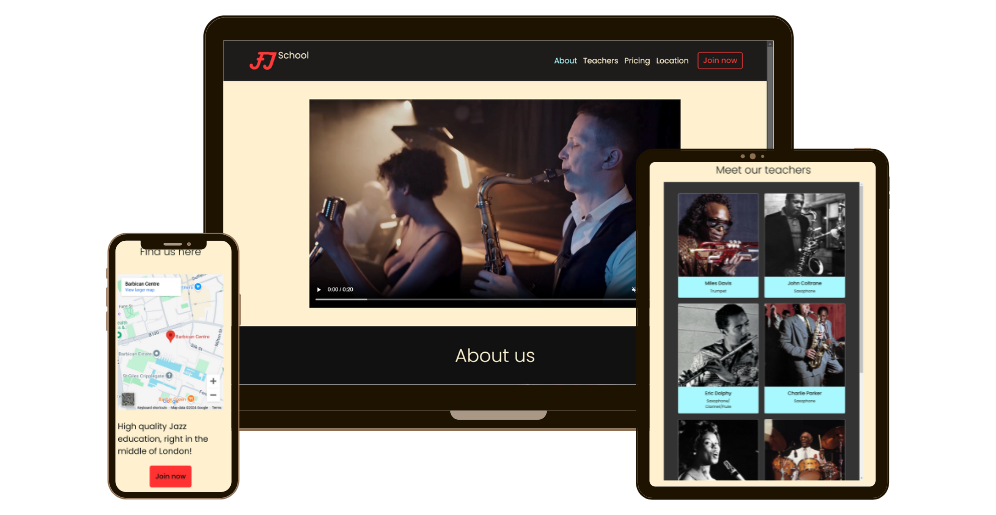

## Features

### Existing Features

#### Navbar

- __Navigation Section__

  - Featured on all pages, the fully responsive navigation bar with links to the different sections of the home page and the contact page.
  - The logo will always take the user to the home page.
  - The button "Join now" will take the user to the contact page, where the navbar will have the "Join now" button removed since it does not apply to the contact page.
  - The navbar will always allow the user to easily navigate the site without using the "back" and "forward" buttons on the browser.
  - The navbar collapses on smaller screens providing a "burger" menu with the links to the different sections of the home page and the contact page.
  - The navbar hides when the user scrolls down the page and shows when the user scrolls up the page - This is to provide a larger view height of the site for medium to small screens resulting in an elevated user experience.

##### Navbar


##### Navbar - Contact/Success Page


##### Navbar Collapsed
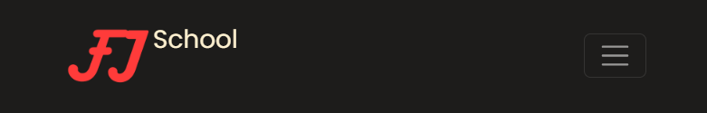

#### Home Page
  
- __Hero section__

  - The hero section features a video to excite the user to learn more about the school.
  - The video is muted (although has no sounds), looped, and has auto play disabled for user worried about data usage.
  - The video has controls for the user to pause and play the video, and toggle between full screen and normal view.
  - The video is short (20s) to save user bandwidth.
  - The video's resolution has been lowered to save user bandwidth. 
  - The video is responsive and scales to fit the screen.

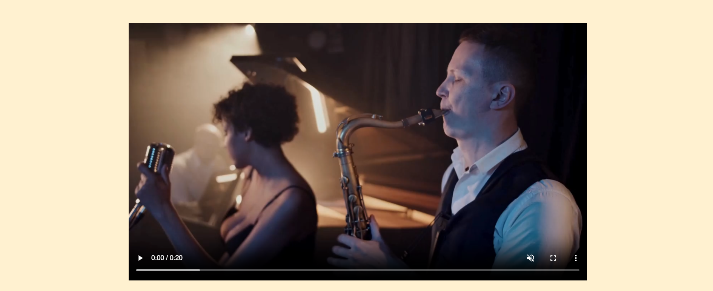


- __About Section__

  - The about section features information about what the school offers.
  - The about section has a carousel that shows the different instruments that are taught.
  - The carousel images are in `.webp` format.
  - The about section is responsive to different screen sizes.

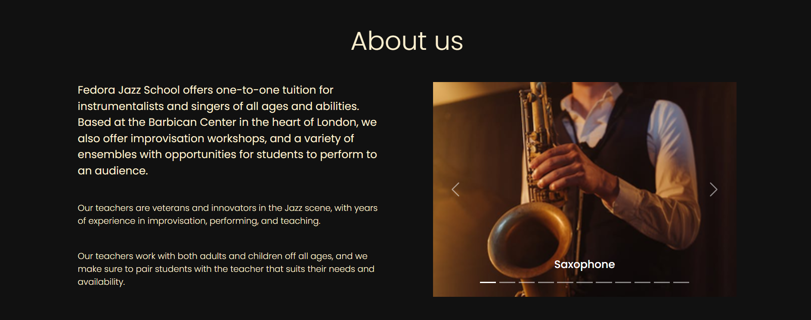

- __Teachers Section__

  - The teachers section features a Bootstrap card grid that show the different teachers.
  - The card grid is scrollable vertically and adjusts to user's view port height.
  - The cards include a picture, name, and the instrument(s) that they teach.
  - The card's images are in `.webp` format.
  - The card grid is responsive to different screen sizes.

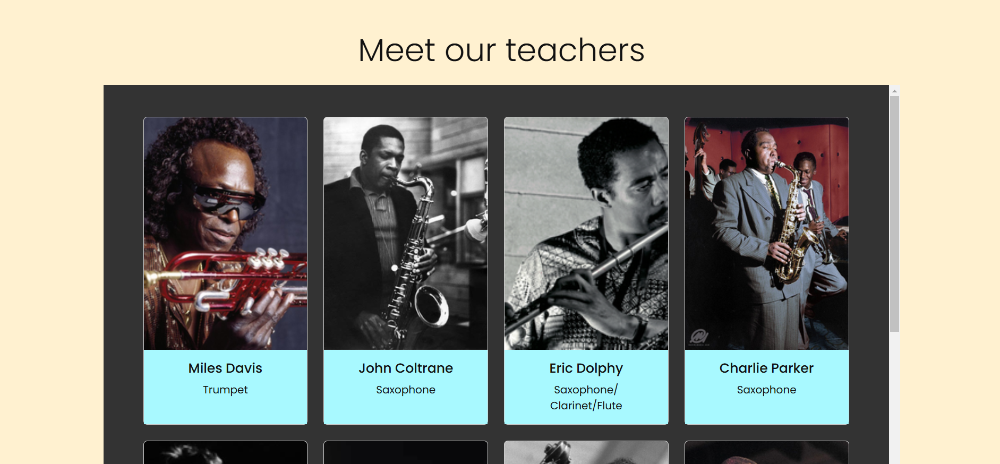

- __Pricing Section__

  - The pricing section features the the pricing presented in a HTML table element. 
  - The pricing section is responsive to different screen sizes.

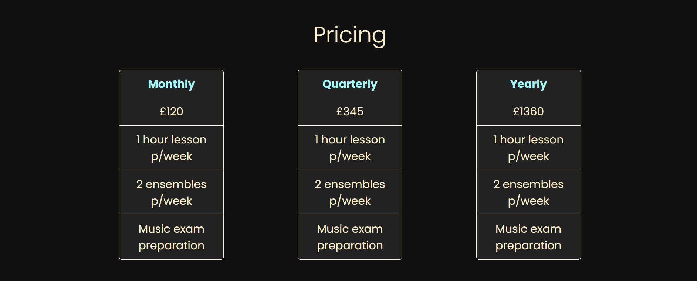

- __Location Section__

  - The location section features the location of the school in a Google Maps iframe.
  - It has a call to action button that takes the user to the contact page.
  - The location section is responsive to different screen sizes.

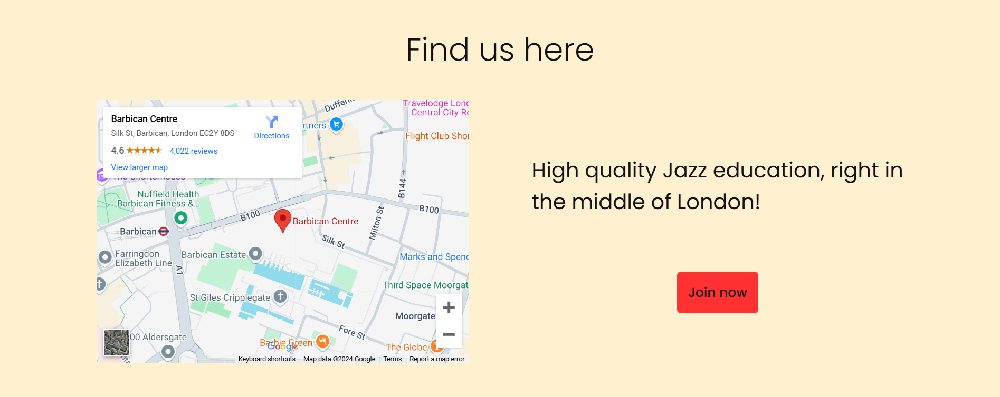

#### Footer

- __Footer Section__

  - The footer features contact info such as address, number, and email.
  - The footer has social media links.
  - The footer is responsive to different screen sizes.

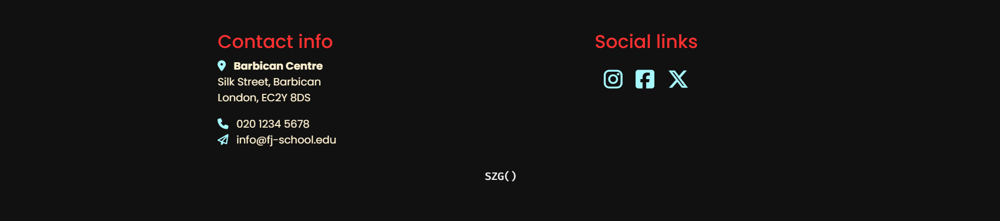

#### Contact Page

- __Contact Form__

  - The contact form features a form that takes the user's name, email, phone no., and message.
  - When submitting the form, the user is redirected to a success page.
  - The contact page/form is responsive to different screen sizes.

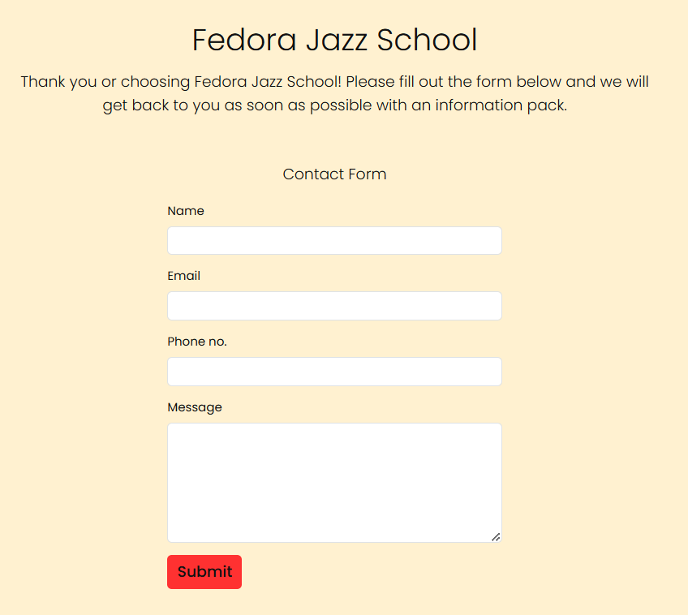

#### Success Page

- __Success Message__

  - The success message features a thank you message.
  - The success message has a button that takes the user to the home page.
  - The success page/message is responsive to different screen sizes.

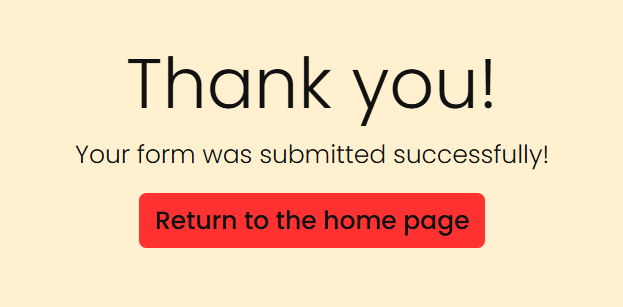

### Features for the future

#### Teachers Page ([#10](https://github.com/SebZG/fedora-jazz/issues/10))

- __Teachers Info__

  - The teachers page will feature further information about each teacher.

## Improvements for the future

- Hosting images/videos on a CDN or cloud storage to reduce project size.

## Design

### User Stories

User stories where used along side GitHub Projects to track progress of development.

- See [here](https://github.com/users/SebZG/projects/3/views/1) for project board.
- See [here](./docs/user-stories.md) for full list.

### Media

The style of the images and videos used in this project were chosen carefully to fit with the project's (jazz) theme.
They should convey the sites purpose straight away to the user.

### Colors

The intention with the color theme was to give a vintage feel with the off-whites and blacks, while using brighter highlights for a modern touch.

- __Main Colors__:
  - Black: #111111
  - Papaya Whip: #FFF1D0
  - White Smoke: #F2F4F3
  
- __Highlight Colors__:
  - Celeste: #A8F9FF
  - Rojo: #FF3131

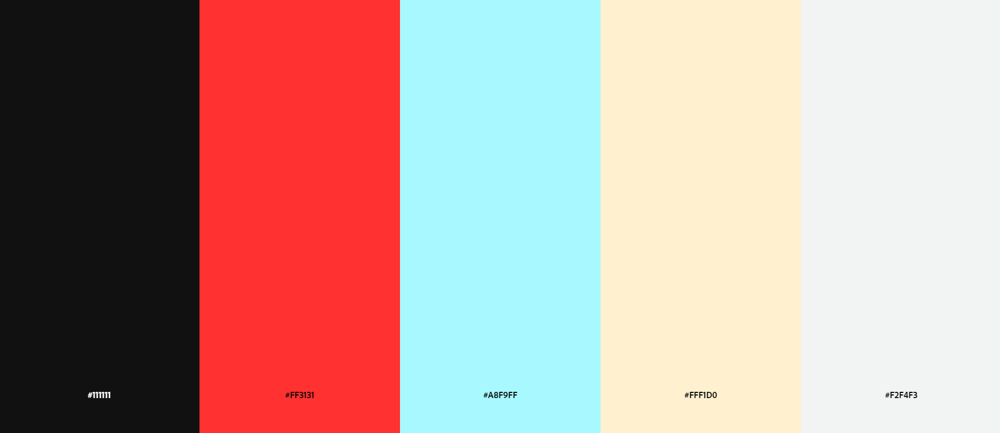

### Typography

- The font chosen for the site was "[Poppins](https://fonts.google.com/specimen/Poppins)" from the [Google Fonts](https://fonts.google.com/) library, with a fall back font of "sans-serif".
- Not only is Poppins supported across different browsers, but it is easy to read and fitted well with the rest of the design.

### Wireframes

The wireframes for this project were created with [Balsamiq](https://balsamiq.com/).

<details>

 <summary>Home Page</summary>

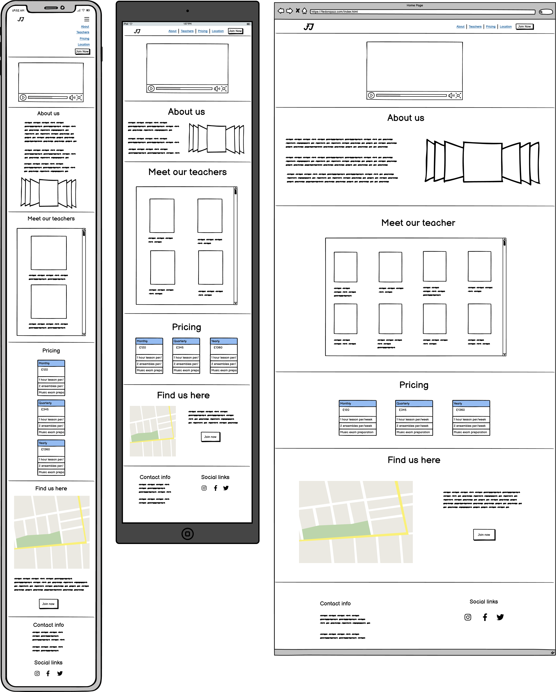
 </details>


 <details>

 <summary>Contact Page</summary>

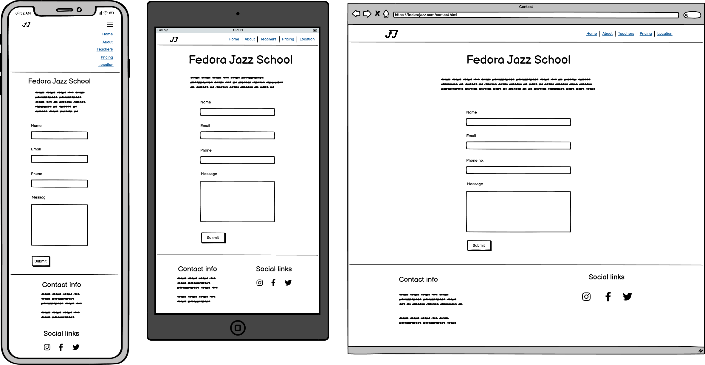
 </details>


 <details>

 <summary>Success Page</summary>

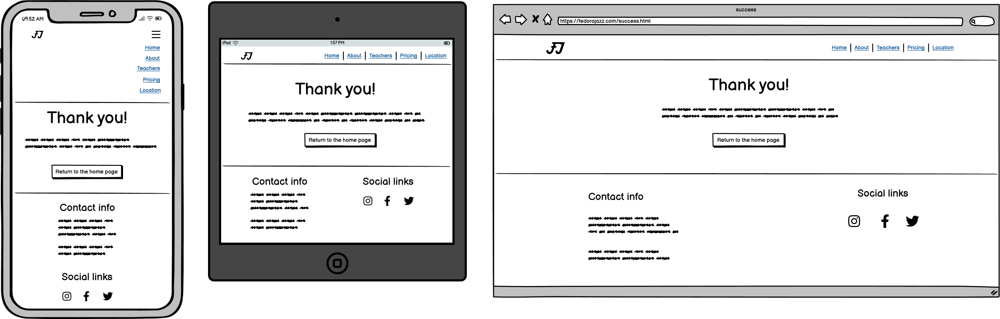
 </details>

## Testing


### Lighthouse Score

Lighthouse in Chrome Dev Tools was used to perform a performance test on the site.

- Performance score was at 50-60% initially due to larger images and video sizes.
  - Image sizes were reduced.
  - Video resolution was lowered.
- Accessibility score was below 75% initially due image formats.
  - All images where converted to `.webp` format.

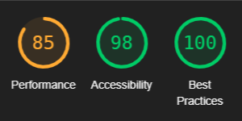

### HTML Validator

[W3C](https://validator.w3.org/nu/) HTML validator was used to validate the HTML code on all `.html` files.

- All `.html` files passed.


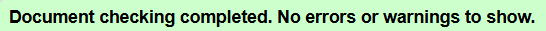

### CSS Validators

[W3C (Jigsaw)](https://jigsaw.w3.org/css-validator/validator?uri=https%3A%2F%2Fvalidator.w3.org%2Fnu%2F%3Fdoc%3Dhttps%253A%252F%252Fcode-institute-org.github.io%252Flove-running-2.0%252Findex.html&profile=css3svg&usermedium=all&warning=1&vextwarning=&lang=en#css) and [CCS Portal](https://www.cssportal.com/css-validator/) CSS validator were used to validate the CSS code.

- Both validators returned issues due to the use of Bootstrap, although working as expected. - No fixes available.
- Both validators returned issues due to the use of CSS variables, although working as expected. - No fixes available.
- Both validators had issues parsing CSS code due to comments in file, although all working as expected. - No fixes available.
  - Even with comments taken out, the validator still gave parsing errors.
- Any error or issues that could be fixed were fixed.

### Manual Testing

#### __Links__
- No broken links.
- External links open in a new tab.

#### __Form__
- No form validation errors.
- When submit button is clicked, the user is taken to success page.
  - The success page has a button that takes the user to the home page.

#### __Responsiveness__
- Navbar is responsive to different screen sizes.
  - Collapses on small screens.
- All pages are responsive to different screen sizes.
- All sections are responsive to different screen sizes.

#### __Navbar__
- Navbar is hidden when scrolling down on all pages.
- Navbar is shown when scrolling up on all pages.

#### __Navbar - Burger Menu__
- Burger menu closes on click.

## Bugs/Issues

### Resolved Bugs/Issues

#### `margin-top` on `body` when hiding navbar

__Issue__:

- The `body` element had a `margin-top` to compensate for the navbar's `position: fixed` properties.<br> 
- When hiding the navbar on scroll, the margin-top off the body needed to be adjusted.

CSS
```css
body {
  /* rest of properties */

  margin-top: 106px; /* When navbar is showing */
}
```

__Solution__:

- JavaScript was used to dynamically change the margin-top of the `body` element when hiding/showing the navbar.

CSS
```css
body.navbar-hidden {
    padding-top: 0px; /* When navbar is hidden */
}
```

JavaScript
```js
// Global variable to keep track of navbar's hidden state
let navbarHidden = false;

// Dynamically change margin-top of body 
const addOrRemoveScrollMarginTop = () => {
	const body = document.querySelector('body');
		
	if (navbarHidden) {
		body.classList.add('navbar-hidden'); // Remove margin-top
	} else {
		body.classList.remove('navbar-hidden'); // Add margin-top
	}
};

const navbar = document.querySelector('.navbar');
let prevScrollPos = window.scrollY;

// Hide navbar when scrolling down.
window.onscroll = () => {
	let currentScrollPos = window.scrollY;

	if (prevScrollPos > currentScrollPos) {
		navbar.style.top = '0px'; // Show navbar
		navbarHidden = false;
	} else {
		navbar.style.top = '-106px'; // Hide navbar
		navbarHidden = true;
	}

	prevScrollPos = currentScrollPos;
	addOrRemoveScrollMarginTop(); // change body's margin-top
};
```

### Unfixed Bugs/Issues

- No issues or bugs left unsolved at the moment.
- No errors in devtools console.

## Deployment

This project was deployed using [GitHub Pages](https://pages.github.com/).

Steps to deploy:

- In project's repository, click on "Settings" in the top right corner.
- Click on "Pages".
- Under "Branch", select the branch and folder to deploy from.
- Click "Save".

The site will take a few seconds to deploy.

- The status of the deployment can be seen by clicking on "Actions" tab on the top.
- Once deployed, the link can be viewed in the "Pages" section from before.

## Credits/Tools/Technologies

## Languages

- HTML
- CSS
- JavaScript

## Libraries

- [__Bootstrap__](https://getbootstrap.com/)
  - CSS Library for layouts, responsive design, and components.

- [__Font Awesome__](https://fontawesome.com/)
  - Icons library.

- [__Google Fonts__](https://fonts.google.com/)
  - Fonts library.

## Code

- [__W3Schools__](https://www.w3schools.com/)
  - [Hide navbar on scroll](https://www.w3schools.com/howto/howto_js_navbar_hide_scroll.asp)
    - Adapted for project.

### Design

- [__Balsamiq__](https://balsamiq.com/)
  -  Used to create the [wireframe](./docs/wireframes.pdf).

- [__Adobe Color__](https://color.adobe.com/)
  -  Used to create the [color palette](./docs/color-palette.png).

### Media

- [__Pexels__](https://www.pexels.com/)
  - Used to source images.
  - Used to source videos.

### Editors

- [__Canva__](https://www.canva.com/)
  - Used to create the [logo](./public/fj-black-red-canva-500x500.webp).
  - Used to create the [hero video](./assets/media/videos/fj-hero-video.mp4).
  - Used to create [mock ups](./docs/mock-up-landscape.png).

- [__Cap Cut__](https://www.capcut.com/)
  - Used to change the resolution of the [hero video](./assets/media/videos/fj-hero-video.mp4).

### Other Tools

- [Free Convert](https://www.freeconvert.com/)
  - Used to convert images to `.webp` format.

- [Image Resizer](https://imageresizer.com/)
  - Used to resize images.